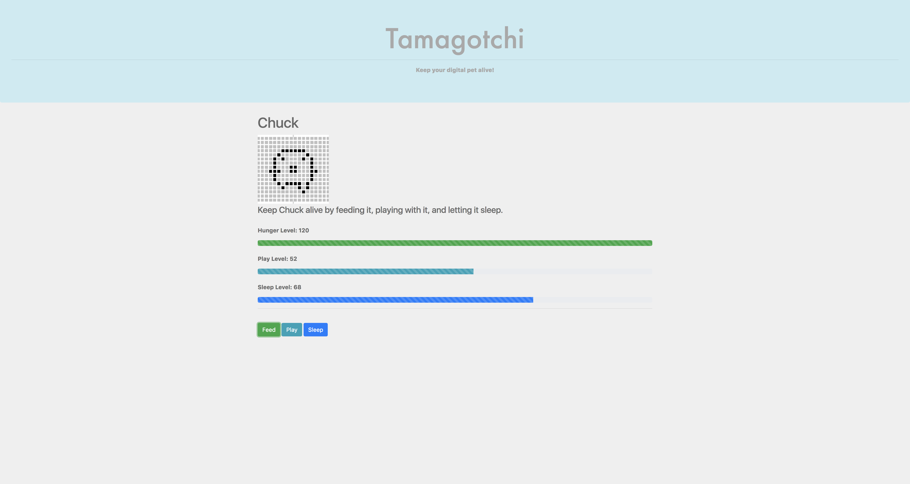
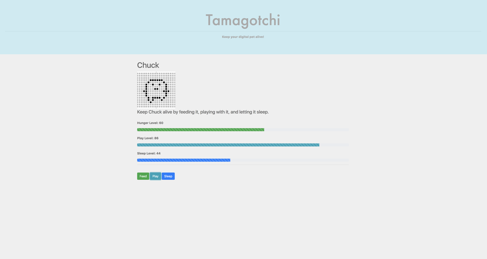
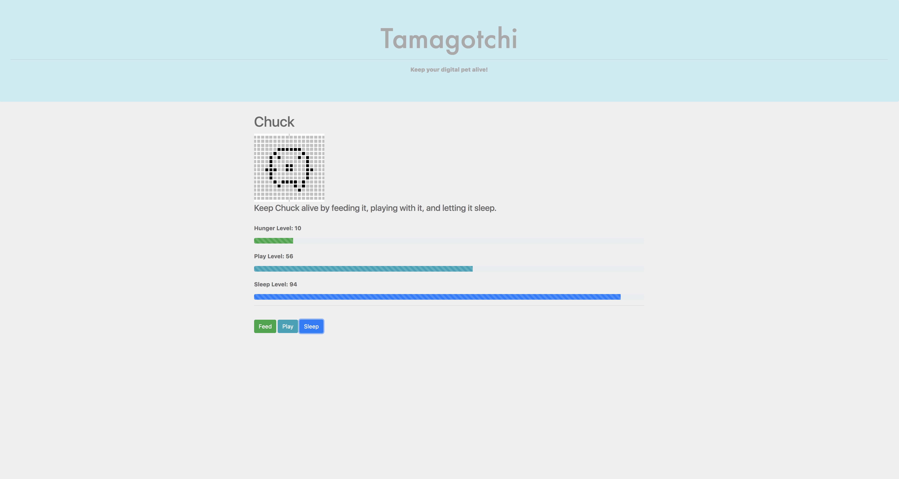
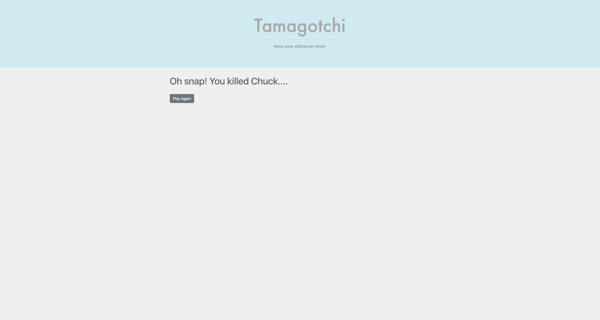

# Tamagotchi

#### Epicodus Spring 2018

#### By **Nanette Girzi**

## Description

Javascript program, based on the 90s Tamagotchi game. Keep your pet alive!

_ The home page of the application.

_ Enter Tamagotchi name

_ Game start page

_ Feed Tamagatchi

_ Play with Tamagatchi

_ Let Tamagatchi sleep

_ Tamagatchi died

## Setup/Installation Requirements

Run the following commands in Terminal:

* $ git clone
* $ cd tamagatchi
* $ npm install
* $ npm run start

## Specifications

#### Determine if a users input is a haiku or not
#### Return confirmation if entry is a haiku
#### Return false if it is not a haiku, and lets the user know what is wrong and how to fix it
#### Autogenerate a haiku

## Known Bugs

No known bugs at this time.

## Support and contact details

If you have suggestions please email ngirzi@gmail.com

## Technologies Used

* JavaScript
* CSS
* HTML
* Bootstrap
* Node
* Webpack

### License

*This software is licensed under the MIT license.*

Copyright (c) 2018 **Nanette Girzi**
